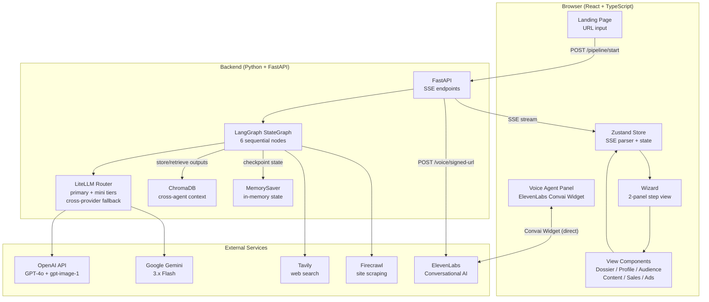
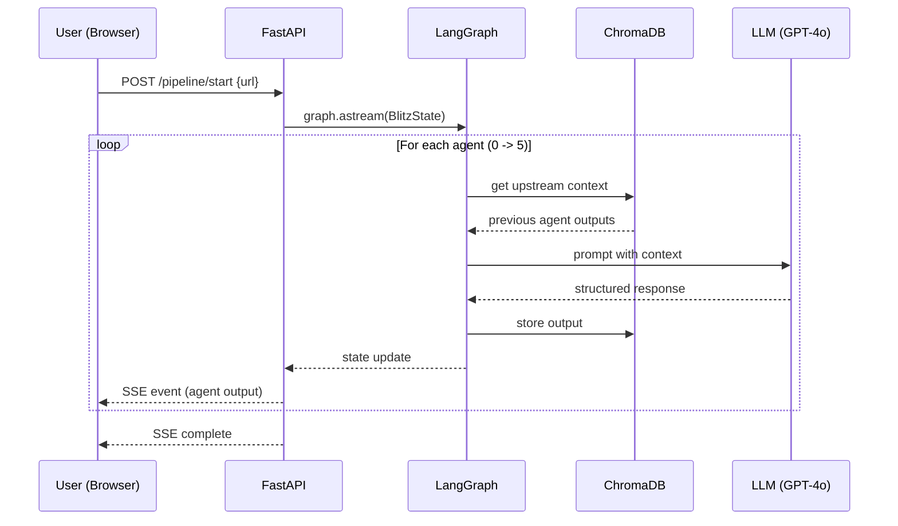

# Blitz

**Enter a company URL. Get a complete marketing pipeline.**

Blitz turns a single company URL into a full marketing package: research dossier, brand profile, audience segments, content strategy, sales outreach and ad creatives, start to finish with no manual steps.

---

## How It Works

A user pastes a company URL into the landing page. The backend spins up a LangGraph pipeline of 6 sequential AI agents, each building on the previous agent's output stored in ChromaDB. As each agent completes, it streams the result to the browser via SSE and the next agent begins automatically. The result is a complete marketing package generated from a single URL.

```
Company URL  -->  6 AI Agents (sequential, automated)  -->  Full Marketing Package
```

| Step | Agent | Output |
|------|-------|--------|
| 0 | **Research Scout** | Company dossier, site-content category extraction, press coverage, competitor profiles (dual search + LLM fallback), AEO score |
| 1 | **Profile Creator** | Brand DNA, positioning, USPs, marketing gaps |
| 2 | **Audience Identifier** | 3-5 synthetic audience segments with demographics & psychographics |
| 3 | **Content Strategist** | Social posts, email campaigns, blog outlines, 30-day calendar |
| 4 | **Sales Agent** | Cold email sequences, LinkedIn DMs, lead scoring + optional voice agent |
| 5 | **Ad Creative Generator** | Google/Meta/LinkedIn ad copy, A/B variants + optional AI visuals |

---

## System Architecture



### Data Flow



---

## Code Structure

### Agent Module Pattern

Every agent (`agent_1` through `agent_5`) follows the same 4-file pattern:

```
agent_N_name/
├── node.py      # LangGraph node function - reads ChromaDB, calls LLM, stores output, returns state
├── schemas.py   # Pydantic models for structured output (e.g., MarketingProfile, AudienceOutput)
├── prompts.py   # System + user prompt templates
└── __init__.py
```

Agent 0 (Research) adds `research.py` (Tavily/Firecrawl/AEO logic) and `progress.py` (sub-step streaming).

Each agent also has a `test_agent*.py` script that calls the live APIs. They are manual and not part of the test suite.


## Tech Stack

| Layer | Technology |
|-------|-----------|
| Orchestration | LangGraph (StateGraph, sequential pipeline) |
| LLM Routing | LiteLLM Router - `primary` and `mini` tiers, each with automatic cross-provider fallback |
| Vector DB | ChromaDB (cross-agent context sharing + audit trail) |
| Backend | Python, FastAPI, SSE streaming, Pydantic |
| Frontend | React, TypeScript, Vite, Tailwind CSS v4 (Warm Analog theme - Syne font, burnt orange/sage palette), Zustand, Headless UI |
| Research | Tavily API, Firecrawl |
| Voice | ElevenLabs Conversational AI via `@elevenlabs/convai-widget-embed` (dynamic agent creation, Ava persona, floating overlay widget) |
| Image Gen | `gpt-image-1` via LiteLLM (user-triggered, capped per run) |

---

## Quick Start

### Prerequisites

- Python 3.11+
- Node.js 18+
- [uv](https://docs.astral.sh/uv/) (Python package manager)
- API keys: OpenAI, Gemini, Tavily, Firecrawl

### 1. Clone and set up backend

```bash
cd backend
cp .env.example .env
# Add your API keys to .env

uv sync                # dependencies are declared in pyproject.toml
uv run uvicorn app.main:app --host 0.0.0.0 --port 8001
```

### 2. Set up frontend

```bash
cd frontend
npm install
npm run dev
```

### 3. Open the app

Navigate to `http://localhost:5173`, enter a company URL, and watch the pipeline run.

### Voice Test Page

Visit `http://localhost:5173/?voice-test` for a standalone voice agent testing interface.

---

## Running it for other people

Locally the API is open. Before you put it on a public URL:

- Set `ACCESS_KEY`. Every route that spends money then needs an `X-Blitz-Key` header with that value, and the check is constant-time.
- Set `DAILY_RUN_CAP` to limit pipeline runs per day. It backs up the access key if the key leaks.
- Set `CORS_ORIGINS` to the origin your frontend is served from.

`backend/Dockerfile` builds the API. `infra/aws/` has Terraform for ECS Fargate behind a load balancer, with the frontend on S3 and CloudFront. Its [README](infra/aws/README.md) has the steps. A run calls paid APIs (OpenAI, Gemini, Tavily, Firecrawl), so a public demo costs money for every visitor.

## AI Telemetry

Every model call gets logged: which run and agent it came from, the model, token
counts, cost, how long it took, and whether it worked. Dashboard is at
`http://localhost:5173/?telemetry`.

```
GET /telemetry/summary        totals and success rate
GET /telemetry/agents         cost and latency per agent
GET /telemetry/runs           one row per run
GET /telemetry/runs/{run_id}  every call in a single run
```

This hooks into LiteLLM as a callback rather than wrapping our own calls,
because the router retries and falls back on its own and those attempts get
billed too. Cost comes from LiteLLM rather than a hardcoded price list.

First run through it showed agent 0 making 11 of the 13 calls and about 70% of
the spend, which was not what I expected.

Langfuse tracing can be wired in alongside it - set `LANGFUSE_PUBLIC_KEY` and
`LANGFUSE_SECRET_KEY` in `.env` and it registers automatically on startup,
no code changes needed. Off by default; the app runs the same without it.

## MCP Server

`backend/mcp_server.py` exposes the research pipeline's Tavily search and
Firecrawl scrape as MCP tools, so an MCP client can call them directly
instead of only agent 0 deciding when to. It's additive - the pipeline itself
still runs the way it always has, nothing in it imports this file.

```
cd backend
python mcp_server.py                # runs a real stdio MCP server
pytest tests/test_mcp_server.py     # in-process tests, no server process, no spend
```

Built against `mcp` v2, the current stable line - not the older v1 branch and
not the newer stateless spec that was still in beta at the time.

## Tests

```bash
cd backend
pytest tests
ruff check app tests
```

Nothing in the suite hits the network or a real model, so it runs in a few
seconds and costs nothing. It covers the helper functions, each agent's output
schema, and a full graph run with the external calls stubbed.

Two things it specifically watches for, both from bugs that got through:

- Prompt templates that crash on `.format()`. The critic prompt had a JSON
  example in it and every run died on the last node.
- Blank error messages. A timeout stringifies to nothing, so the UI showed an
  empty box instead of a reason.

`backend/test_script.py` and the `test_agent*.py` files are manual scripts that
call live APIs. They are not part of the suite.

CI runs the tests, the linter and the frontend build on every push.

## Evals

Two scripts check the pipeline's safety nets. Neither makes a network call or costs anything.

```
cd backend
python run_evals.py               # schema conformance and the grounding detector
python reliability_benchmark.py   # how much the router's retries help
```

**Schema conformance.** Each of the five agents that parse model JSON (profile through ads) is given four bad responses: plain text, valid JSON in the wrong shape, an empty string, and truncated JSON. All 20 were rejected, and every agent accepted a well-formed response. Agent 0 is left out because it has its own fallback path.

**Grounding.** Two narrow checks on generated copy: does it name the company or a competitor, and does it reuse a number that is actually in the research. The script scores 5 hand-written examples (60% and 40%). That only shows the detector can tell grounded copy from generic copy. It says nothing about how grounded real pipeline output is, and I haven't measured that yet.

**Retry benchmark.** The script builds the real router, injects transient failures at a fixed rate, and compares one bare attempt with the production config (retries, typed retry policy, cross-provider failover). A run is 12 calls, projected as 1-(1-p)^12 from the per-call rate. 500 trials per cell:

| injected failure rate | bare call | router call | bare run | router run |
|---|---|---|---|---|
| 5% | 6.4% | 0% | 54.8% | 0% |
| 10% | 11.0% | 0% | 75.3% | 0% |
| 20% | 19.4% | 0% | 92.5% | 0% |
| 30% | 27.2% | 0% | 97.8% | 0% |

Failures are injected independently on each attempt, which is kinder to retries than a real rate-limit storm, where a retry a moment later hits the same wall. Read it as what the config buys against independent transient errors, not as a failure rate for any provider.

## Feedback and experiments

Every agent's output has a "Was this useful?" yes/no under it, and the A/B variations tab has a "Pick Variant X as the better ad" button. Both are stored in the same SQLite file as the telemetry, so cost sits next to the quality signal. Clicking again changes your vote instead of adding another.

There is also one live experiment, `ads_critic`. The ads agent normally drafts copy and then a critic reviews it, and can send it back for another pass. That costs extra model calls, and I don't know if the results are better enough to justify them. With `EXPERIMENTS_ENABLED=true`, each new run is randomly given the critic loop or skips it (the split is a hash of the run id, so a run always gets the same answer). The Telemetry page then compares the two on thumbs-up rate for the ads step, with a 95% range, alongside average cost and LLM time per run.

It is off by default, so nothing changes unless you turn it on. It also gives no verdict until each side has at least 20 rated runs, since a handful of thumbs can't tell you anything. The comparison is a two-proportion z-test, which is fine at those sizes and rough below them.

There is no real data behind this yet. It's built and tested, but until people use it there are no results to report.

```
POST /feedback/rating       {run_id, agent, value: 1 or -1}
POST /feedback/ad-pick      {run_id, ad_copy_ref, chosen}
GET  /feedback/summary      thumbs per agent and ad variant picks
GET  /experiments/ads_critic
```

## Key Architecture Decisions

- **Provider-agnostic**: every model is set by environment variable and routed through LiteLLM, with a fallback on the other provider. A full run completes on either OpenAI or Gemini alone. Image generation remains OpenAI-only.
- **Entity extraction**: Company names are extracted from page content via a fast `gpt-4o-mini` call (with regex fallback), handling vanity domains like `joinblossomhealth.com` -> "Blossom Health".
- **Sequential pipeline**: Each agent depends on the previous agent's output. ChromaDB provides cross-agent context sharing - any agent can read any upstream agent's output by `run_id`.
- **SSE streaming**: Real-time progress updates as each agent runs. The backend interleaves two async sources (research sub-step queue + graph state stream) into one SSE event stream. No polling.
- **Dynamic voice agents**: Each voice session creates a new ElevenLabs agent on the fly with the Ava persona + a GPT-4o-mini summary of pipeline knowledge. The `@elevenlabs/convai-widget-embed` web component renders as a floating overlay and handles the full conversation UI.
- **Checkpoint persistence**: `MemorySaver` persists pipeline state in memory. Since the pipeline runs autonomously end-to-end, in-memory state avoids database locking issues while still tracking state per run.

## Project Structure

```
blitz/
├── backend/
│   ├── app/
│   │   ├── agents/
│   │   │   ├── agent_0_research/  # Tavily + Firecrawl + AEO + LLM synthesis
│   │   │   ├── agent_1_profile/   # Brand DNA + positioning
│   │   │   ├── agent_2_audience/  # Segments + synthetic expansion
│   │   │   ├── agent_3_content/   # Social, email, blog, calendar
│   │   │   ├── agent_4_sales/     # Sequences, DMs, lead scoring
│   │   │   ├── agent_5_ads/       # Ad copy + generated visuals
│   │   │   └── agent_voice/       # ElevenLabs browser voice agent
│   │   ├── core/llm.py            # LiteLLM Router (primary + mini tiers)
│   │   ├── db/                    # ChromaDB store + SQLite lead capture
│   │   ├── config.py              # Settings - all env-driven configuration
│   │   ├── main.py                # FastAPI app + SSE endpoints
│   │   ├── graph.py               # LangGraph pipeline definition
│   │   └── state.py               # BlitzState TypedDict
│   └── tests/                     # pytest suite (no network, no API cost)
├── frontend/
│   └── src/
│       ├── components/            # React UI components
│       ├── pages/Landing.tsx      # URL input landing page
│       ├── store/useBlitzStore.ts # Zustand state + SSE parser
│       └── demo/                  # Cached fixture data for demo mode
```

## API Endpoints

| Method | Path | Description |
|--------|------|-------------|
| `POST` | `/pipeline/start` | Start pipeline (returns SSE stream) |
| `POST` | `/ads/{run_id}/generate-image` | Generate an AI ad visual |
| `GET` | `/voice/setup-check` | Check ElevenLabs configuration |
| `POST` | `/voice/session` | PATCH agent prompt and get signed WebSocket URL for browser voice session |
| `GET` | `/voice/transcript/{id}` | Get conversation transcript |
| `POST` | `/feedback/rating` | Thumbs up or down on one agent's output |
| `POST` | `/feedback/ad-pick` | Which ad variant the person preferred |
| `GET` | `/feedback/summary` | Thumbs per agent and ad variant picks |
| `GET` | `/experiments/ads_critic` | Results of the ads critic experiment |
| `GET` | `/health` | Health check |

## Environment Variables

```env
# Required
OPENAI_API_KEY=        # GPT-4o for content, sales, ads
GEMINI_API_KEY=        # Gemini fallback (and second AEO probe)
TAVILY_API_KEY=        # Web search for Research Scout
FIRECRAWL_API_KEY=     # Website crawling

# Optional
ELEVENLABS_API_KEY=    # Voice agent
ELEVENLABS_AGENT_ID=   # Conversational AI agent ID
LANGFUSE_PUBLIC_KEY=   # LLM tracing, off if unset
LANGFUSE_SECRET_KEY=   # LLM tracing, off if unset
LANGFUSE_BASE_URL=     # defaults to https://cloud.langfuse.com
EXPERIMENTS_ENABLED=   # false by default, see Feedback and experiments
ACCESS_KEY=            # required header value for spending routes, empty means open (local only)
DAILY_RUN_CAP=         # pipeline runs per day, 0 means no cap
CORS_ORIGINS=          # comma-separated allowed origins, empty means the local dev ports
```

## What's Next

- **Parallel agent execution** - Fan-out agents with no data dependency (e.g., Content + Sales) to cut pipeline time
- **Feedback loop** - Let downstream agents flag weak upstream outputs and trigger targeted re-generation
- **Campaign export** - One-click export to CSV/PDF or direct push to platforms (HubSpot, Mailchimp, Meta Ads Manager)
- **Multi-run comparison** - Side-by-side diffs across pipeline runs to track how edits and feedback shift outputs
- **Persistent brand memory** - Store generated profiles and audience segments so repeat runs for the same company skip redundant work
- **Auth + multi-tenant** - User accounts with isolated pipeline histories and API key management


